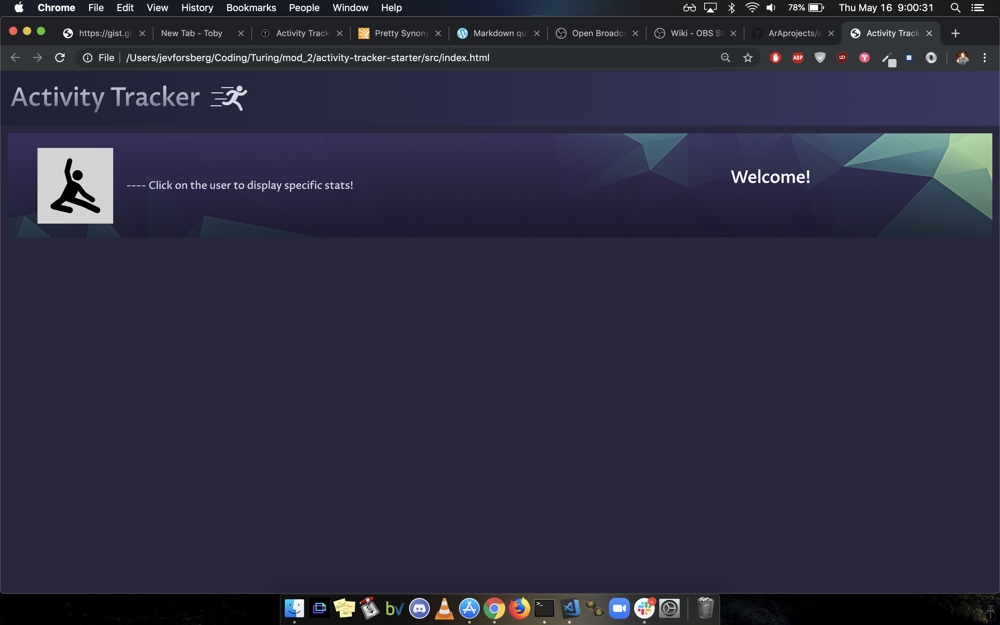
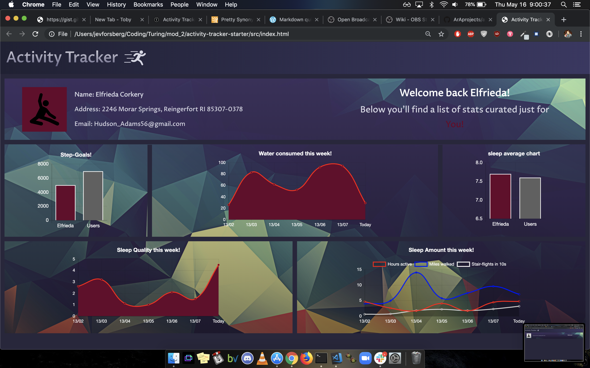
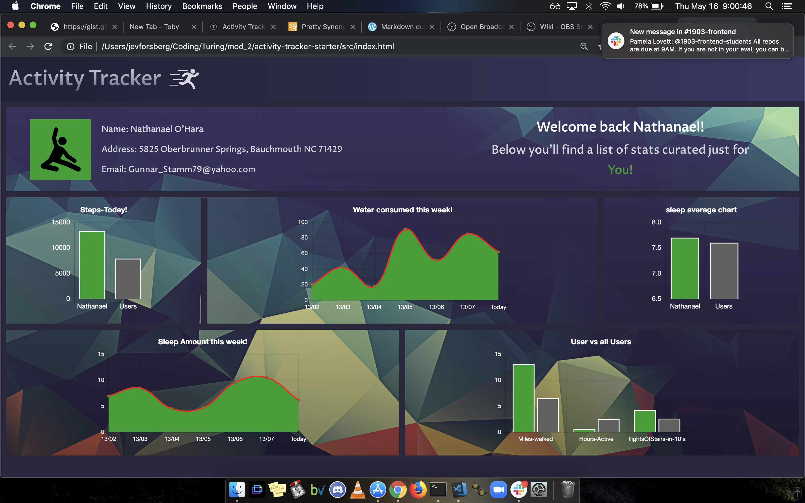

# Activity Tracker

This is a 'Fit-Bit'-like activity, sleep, and hydration tracker. It takes data from 50 randomly generated users from 4 cetagories (personal data, hydration data, sleep data, and activity data), manipulates the information, and displays the requested data in a fashonable and elegant manner.

There are a comprehensive set of mocha/chai tests for all classes, properties, and methods.

Run tests by typing `mocha` in your terminal in your cloned directory.

# Tech used - 
   
   JQuery, Charts.js, javascript.
   ES6 classes that communicate to each other as needed
   Modular, reusable code that follows SRP (Single Responsibility Principle)
   Robust testing suite using TDD
   Object and array prototype methods to perform data manipulation
   Display information on the page while maintaining ability to test class properties and methods
   Created a data dashboard that is easy to use and displays information in a clear way

## Authors

* **Jev Forsberg** - *Initial work* - [baldm0mma](https://github.com/baldm0mma)

* **Alek Aker** - *Initial work* - [ArAprojects](https://github.com/ArAprojects)

## License

This project is licensed under the MIT License - see the [LICENSE.md](LICENSE.md) file for details
