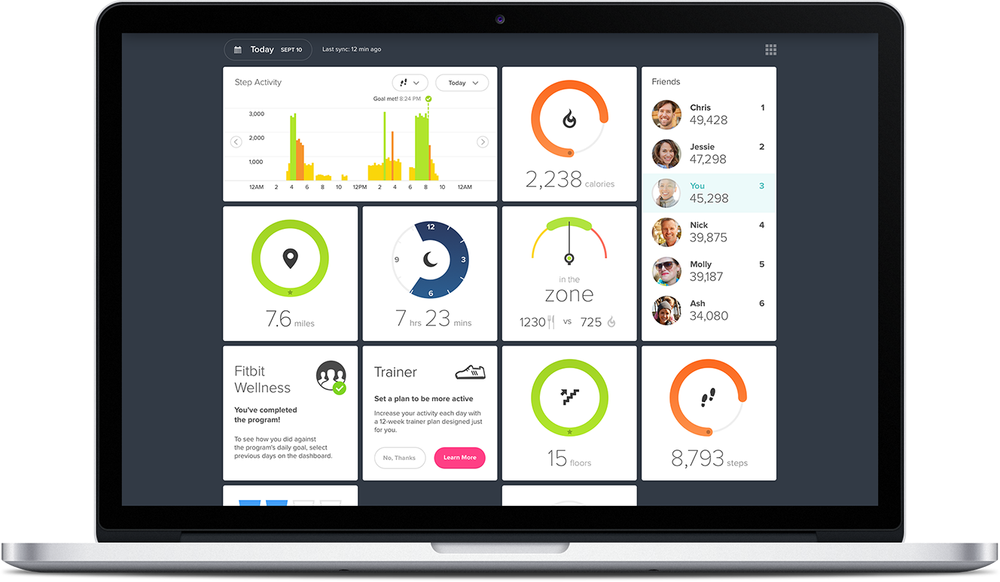

# Activity Tracker

This is a 'Fit-Bit'-like activity, sleep, and hydration tracker. It takes data from 50 randomly generated users from 4 cetagories (personal data, hydration data, sleep data, and activity data), manipulates the information, and displays the requested data in a fashonable and elegant manner.

## Getting Started

1. Clone the repo.
2. Set up the dependancies by running `npm install`
3. Start playing around with the software.

### Prerequisites

You'll need a modern windows, linux, or OS X machine.

## Running the tests

There are a comprehensive set of mocha/chai tests for all classes, properties, and methods.

Set up the dependancies by running `npm install`

Run tests by typing `mocha` in your terminal in your cloned directory.

## Assigned Project Spec

### Goals and Objectives

- Follow the specification below to make a working application

- Implement ES6 classes that communicate to each other as needed
- Write modular, reusable code that follows SRP (Single Responsibility Principle)
- Implement a robust testing suite using TDD
- Use object and array prototype methods to perform data manipulation
- Display information on the page while maintaining ability to test class properties and methods
- Create a data dashboard that is easy to use and displays information in a clear way

## Authors

* **Jev Forsberg** - *Initial work* - [baldm0mma](https://github.com/baldm0mma)

* **Alek Aker** - *Initial work* - [ArAprojects](https://github.com/ArAprojects)

## License

This project is licensed under the MIT License - see the [LICENSE.md](LICENSE.md) file for details